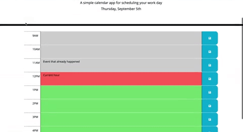

# Simple Day Planner Application

Simple calendar application that allows the user to save events for each hour of the day. This app will run in the browser and feature dynamically updated HTML and CSS powered by jQuery.

The application displays standard business hours from 9am to 5pm and each timeslot allows the user to keep and store their appointments for the day in the space provided. 

## Current Dates and Times

The calendar will also show you the current date and time. As the day goes on the hour time blocks will change color depending on if they are in the Past, Present or Future. This will allow the user to have a visual represntation of the time of day and past appointments. 

* Past = Gray 
* Present = Red
* Future = Green

